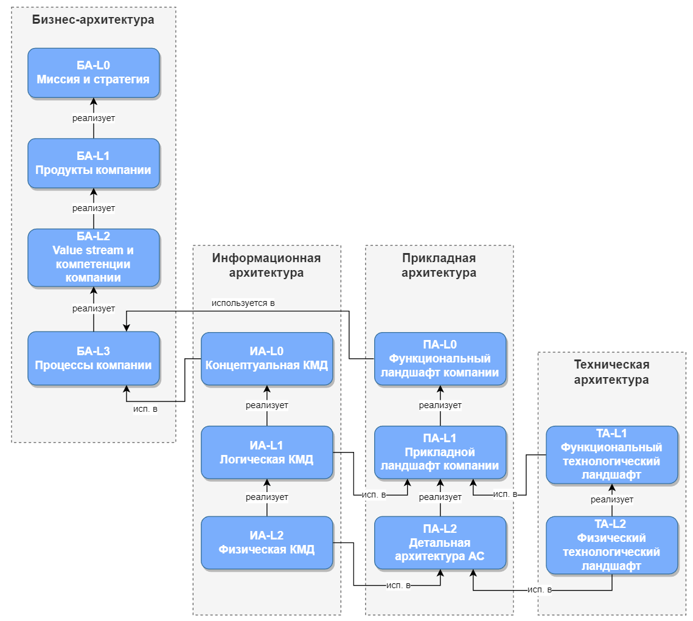

# Введение

## Что такое архитектура компании[^1]

АРХИТЕКТУРА КОМПАНИИ - это фундаментальный способ устройства компании, выраженный в виде структуры ее элементов, работающих и взаимодействующих между собой и внешним миром в соответствии с определенными принципами и правилами​

Если мы управляем развитием корпоративной архитектуры:​

* нам проще трансформироваться (CHANGE) – мы заранее видим в модели TO-BE каков будет результат, можем оценить его стоимость, можем проконтролировать, что он достигнут​

* мы эффективнее осуществляем RUN – выявление и локализация проблем идет проще при наличии актуального «чертежа» модели AS-IS, чем без него​

* сотрудники более мотивированы, т.к. четко видят свою роль и вклад в развитие компании​

* мы своевременно получаем ответы на такие вопросы как:​
1. А хватит ли у нас компетенций для выхода на новый рынок\вывод нового продукта? 
2. Что нам усиливать в первую очередь?
3. Как усиливать компетенции – отдавать на аутсорс, создавать свои процессы, упор на технологии, набирать людей?​
4. Насколько наши ИТ готовы поддержать новые компетенции\процессы? 
5. Что надо усилить, от чего отказаться в ИТ?​
6. Эффективно ли мы тратим ресурсы (время специалистов, деньги, утилизация инфраструктуры)?
7. Как мы работаем с данными? Не теряем ли мы «золотой песок» в отвалах? ​
8. Не копаем ли мы «параллельные тоннели»?​
9. Знаем ли мы места возможных утечек чувствительных данных, как они защищены?
10. и многие другие

## Кто такой Архитектор 2.0

ИТ Архитектор 2.0 - это специалист, который занимается разработкой и внедрением комплексных ИТ-решений для бизнеса. Он должен иметь глубокие знания в области информационных технологий, а также понимание бизнес-процессов и стратегий компании.

ИТ Архитектор 2.0 должен уметь анализировать текущее состояние ИТ-инфраструктуры компании и определять ее потребности в различных ИТ-решениях. Он должен уметь разрабатывать архитектуру системы, выбирать необходимые технологии и инструменты, а также определять требования к персоналу.

ИТ Архитектор 2.0 также должен уметь эффективно взаимодействовать с другими специалистами в компании, включая менеджеров, разработчиков, тестировщиков и аналитиков. Он должен уметь объяснять сложные технические концепции в понятной форме и работать в команде для достижения общих целей.

ИТ Архитектор 2.0 должен быть готов к изменениям и быстро адаптироваться к новым технологиям и требованиям рынка. Он должен постоянно улучшать свои знания и навыки, чтобы оставаться конкурентоспособным в быстро меняющемся мире ИТ.

*Определение от ChatGPT*

## Кто такой Архитектор 1.0

ИТ Архитектор 1.0 - это предшественник ИТ Архитектора 2.0, который также занимался разработкой и внедрением ИТ-решений для бизнеса. Однако, в отличие от ИТ Архитектора 2.0, ИТ Архитектор 1.0 был более ориентирован на технические аспекты работы системы, а не на бизнес-процессы компании. Кроме того, ИТ Архитектор 1.0 не обладал таким широким спектром знаний и навыков, как ИТ Архитектор 2.0, и не уделял должного внимания взаимодействию с другими специалистами в компании.

*Определение от ChatGPT*

## Архитектура предприятия – подход к моделированию​

Существует множество различных подходов к описанию архитектуры компании. В ГПБ была выбрана методология TOGAF. При этом мы не пытаемся внедрить классическую методологию TOGAF, мы используем комбинированный подход, выбирая только те инструменты, которые закрывают наиболее критичные риски компании.

Согласно методологии TOGAF архитектура предприятия делится на 4 домена:

1. Бизнес-архитектура - описание бизнес-процессов компании
2. Информационная архитектура - описание архитектуры данных
3. Прикладная архитектура - описание архитектуры программных продуктов (системы, сервисы, приложения и т.д.)
4. Техническая архитектура - описание архитектуры инфраструктуры

В основе подхода заложены следующие правила:​
​
1. Сначала "логика" - потом "физика". Любая тема раскрывается сначала на идейном (концептуальном) уровне, и только потом «приземляется» на реализацию\технику​​

2. "Логика" ничего не знает про "физику", "физика" все знает про "логику". При проработке идеи (концепции) неправильно жестко связывать ее с деталями реализации (ведь реализаций может быть несколько и они могут меняться во времени чаще, чем идея). Поэтому в объектах, описывающих логику, не должно быть ссылок на физическую реализацию. Обратно - при проработке "физики" уместно ссылаться на логический слой, чтобы явно показать что именно мы реализуем данным физическим объектом​​

3. "Статика" должна быть подтверждена "динамикой". Для обеспечения полноты и непротиворечивости модели статическая схема должна быть подкреплена описанием динамических сценариев, иллюстрирующих, что все объекты из статичной картинки задействованы в этих сценариях​​

4. Не усложнять простые вещи (keep simple things simple). Не обременять описание архитектуры лишними деталями, фокусироваться на сути. Там где можно мысль выразить простыми словами\образами – использовать их​​

5. Сложные задачи должны быть выполнимыми (make complex things possible). Если задача сложная и не решается "в лоб" - декомпозировать ее на простые составляющие, а далее - см. п.4

[^1]: Термины «архитектура компании», «корпоративная архитектура», «enterprise architecture» здесь и далее являются синонимами​.
